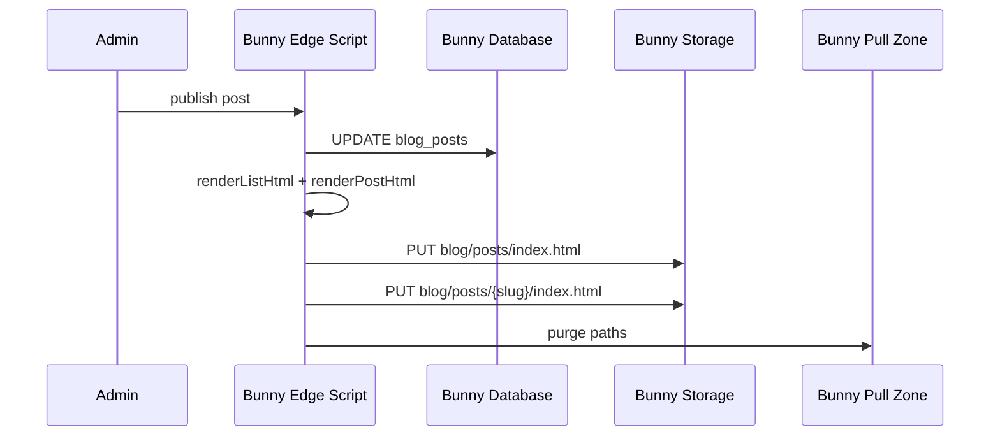
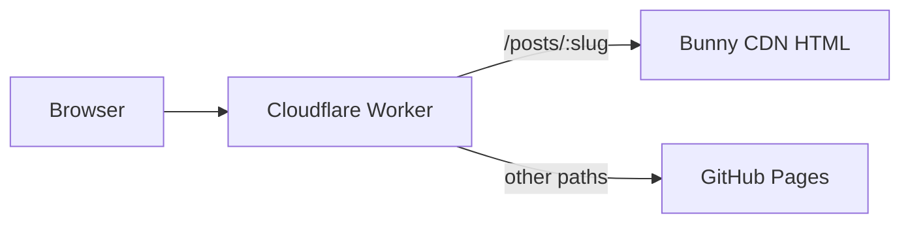

# Blog Option B: Bunny Storage + CDN with thin Cloudflare proxy

## Clarification: Bunny vs Cloudflare

**All blog logic lives on Bunny.** Cloudflare is not a second blog backend.

| Layer | Responsibility |
|-------|----------------|
| Bunny edge script (`75941`) | Admin API, DB, render HTML on publish, upload to Storage, purge CDN |
| Bunny Storage + Pull Zone | Host cached HTML at `https://{pull-zone}.b-cdn.net/blog/posts/...` |
| Cloudflare Worker (thin) | Route `dicebastion.com/posts/*` → fetch CDN HTML (because main domain is Cloudflare → GitHub Pages, not Bunny) |

The Worker does **not** replace the Bunny edge script. Browsers hitting `dicebastion.com` never reach `*.bunny.run` unless something at the domain edge forwards them. GitHub Pages cannot serve dynamic post slugs without a rebuild.

**Routing choice (confirmed):** thin Worker proxy (~20 lines), no blog logic in Worker.

---

## Build speed

Blog publish **does not** trigger Hugo CI. Remove `repository_dispatch` (`blog-published`) and `generate-blog-content.js` from [`.github/workflows/hugo.yml`](.github/workflows/hugo.yml).

Hugo still builds on code pushes to `master` — not on publish.

---

## Publish flow (Bunny only)

Storage paths (existing `dicebastion` zone):

- `blog/posts/index.html` — list (event-style cards)
- `blog/posts/{slug}/index.html` — full article for humans + crawlers
- `blog/posts/sitemap.xml` — optional

---

## Request flow (Worker proxy only)

Worker changes in [`worker/src/index.js`](worker/src/index.js):

- `GET /posts/:slug` → `fetch(BUNNY_CDN_URL + '/blog/posts/' + slug + '/index.html')`
- `GET /posts/` → proxy list HTML from CDN (recommended) or pass to origin
- `GET /posts/sitemap.xml` → proxy from CDN

Env: `BUNNY_CDN_URL` (e.g. `https://dicebastion.b-cdn.net`)

---

## Implementation todos

1. **Edge script** — render + Storage upload + CDN purge on publish/unpublish; remove `triggerBlogPublishDeploy` and `/internal/blog/published`
2. **Worker** — thin `/posts/*` proxy only; add `BUNNY_CDN_URL`
3. **Hugo CI** — remove blog generation steps and `scripts/generate-blog-content.js`
4. **Admin + README** — update messaging and env var docs (Storage keys, purge API, drop `BLOG_BUILD_SECRET` / `GITHUB_DEPLOY_TOKEN` for blog)

---

## Out of scope

- Blowfish taxonomy pages for blog posts (unless added later)
- Pop stashed runtime-API WIP — cherry-pick CSS/markup only
