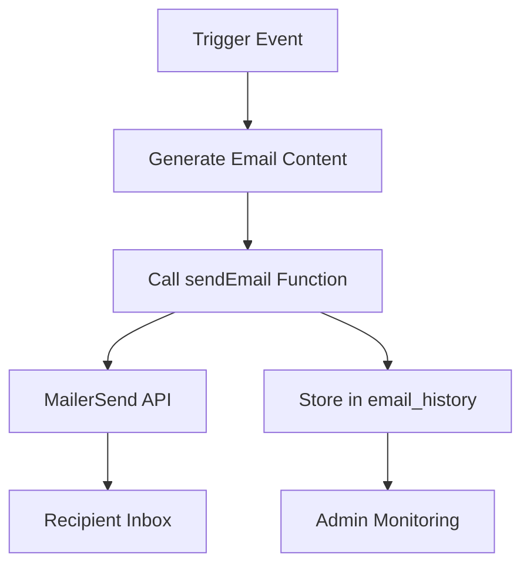

# 📧 Dice Bastion Email System Documentation

## 📋 Overview

This document provides comprehensive documentation for the Dice Bastion email system, including all automated email types, templates, and sending mechanisms.

## 🎯 Email System Architecture

### Components
1. **Email Service Integration**: MailerSend API
2. **Email Templates**: Modular template system
3. **Email History**: Database tracking and auditing
4. **Sending Logic**: Centralized sendEmail function
5. **Cron Jobs**: Scheduled email processing

### Flow Diagram


## 📧 Email Types

### 1. Membership Emails

#### Welcome Email
- **Trigger**: Successful membership purchase or renewal
- **Template**: `getWelcomeEmail()`
- **Content**: Membership details, benefits, next steps
- **Timing**: Immediately after payment confirmation

#### Renewal Success Email
- **Trigger**: Successful auto-renewal payment
- **Template**: `getRenewalSuccessEmail()`
- **Content**: New membership period, payment confirmation
- **Timing**: Immediately after renewal processing

#### Upcoming Renewal Warning
- **Trigger**: 2 days before auto-renewal
- **Template**: `getUpcomingRenewalEmail()`
- **Content**: Renewal reminder, payment method info
- **Timing**: Scheduled cron job at 2 AM UTC

#### Renewal Failed Email
- **Trigger**: Failed auto-renewal attempt
- **Template**: `getRenewalFailedEmail()`
- **Content**: Failure notice, update payment instructions
- **Timing**: Immediately after failed payment

#### Final Renewal Failure Email
- **Trigger**: After 3 failed renewal attempts
- **Template**: `getRenewalFailedFinalEmail()`
- **Content**: Auto-renewal disabled, manual renewal instructions
- **Timing**: After final failed attempt

### 2. Event Emails

#### Ticket Confirmation Email
- **Trigger**: Successful event ticket purchase
- **Template**: `getTicketConfirmationEmail()`
- **Content**: Event details, ticket info, QR code
- **Timing**: Immediately after payment confirmation

#### Event Reminder Email ⭐ NEW
- **Trigger**: 1 day before event
- **Template**: `getEventReminderEmail()`
- **Content**: Event reminder, location, what to bring
- **Timing**: Scheduled cron job at 9 AM UTC

### 3. Shop Emails

#### Order Confirmation Email
- **Trigger**: Successful shop order payment
- **Template**: `generateShopOrderEmail()`
- **Content**: Order summary, shipping info, receipt
- **Timing**: Immediately after payment confirmation

### 4. Admin Emails

#### Membership Notification
- **Trigger**: New membership purchase
- **Template**: `getAdminNotificationEmail('membership')`
- **Content**: Customer details, membership plan
- **Recipient**: admin@dicebastion.com

#### Event Ticket Notification
- **Trigger**: New event ticket purchase
- **Template**: `getAdminNotificationEmail('ticket')`
- **Content**: Customer details, event info
- **Recipient**: admin@dicebastion.com

#### Shop Order Notification
- **Trigger**: New shop order
- **Template**: `getAdminNotificationEmail('shop')`
- **Content**: Order details, customer info
- **Recipient**: admin@dicebastion.com

## 📁 Email Template Structure

### Location
All email templates are located in `worker/src/email-templates/`

### Template Files

#### Membership Templates
- `membership-welcome.js` - Welcome email for new members
- `renewal-success.js` - Successful renewal confirmation
- `renewal-reminder.js` - Upcoming renewal warning
- `renewal-failed.js` - Failed renewal notification
- `renewal-final-failed.js` - Final failure notification

#### Event Templates
- `ticket-confirmation.js` - Ticket purchase confirmation
- `event-reminder.js` - Event reminder (1 day before) ⭐ NEW

#### Shop Templates
- `shop-order.js` - Order confirmation and receipt

#### Admin Templates
- `admin-notification.js` - Admin alert templates

### Template Function Signature
```javascript
function getEmailTemplate(params) {
  return {
    subject: 'Email Subject',
    html: '<html>...</html>',
    text: 'Plain text version...'
  }
}
```

## 🔧 Email Sending Function

### sendEmail Function
```javascript
async function sendEmail(env, {
  to,              // Recipient email
  subject,         // Email subject
  html,            // HTML content
  text,            // Plain text content
  emailType,       // Type for tracking (e.g., 'membership_welcome')
  relatedId,       // Related entity ID (e.g., membership ID)
  relatedType,     // Related entity type (e.g., 'membership')
  metadata         // Additional metadata for tracking
})
```

### Features
- **Automatic Retries**: Handles temporary failures
- **Error Logging**: Comprehensive error tracking
- **Database Logging**: Stores all sent emails in `email_history`
- **Rate Limiting**: Prevents API abuse
- **Validation**: Email format validation

## 📊 Email History Tracking

### Database Table
```sql
CREATE TABLE IF NOT EXISTS email_history (
  id INTEGER PRIMARY KEY AUTOINCREMENT,
  recipient_email TEXT NOT NULL,
  subject TEXT NOT NULL,
  email_type TEXT NOT NULL,
  related_id INTEGER,
  related_type TEXT,
  status TEXT NOT NULL, -- 'sent', 'failed', 'queued'
  error_message TEXT,
  metadata TEXT, -- JSON with additional data
  sent_at TEXT NOT NULL DEFAULT (strftime('%Y-%m-%dT%H:%M:%fZ','now')),
  created_at TEXT NOT NULL DEFAULT (strftime('%Y-%m-%dT%H:%M:%fZ','now'))
)
```

### Query Examples

#### Get Recent Emails
```sql
SELECT * FROM email_history
WHERE sent_at >= datetime('now', '-7 days')
ORDER BY sent_at DESC
LIMIT 100;
```

#### Get Emails by Type
```sql
SELECT 
  email_type,
  COUNT(*) as count,
  SUM(CASE WHEN status = 'failed' THEN 1 ELSE 0 END) as failed
FROM email_history
WHERE sent_at >= datetime('now', '-30 days')
GROUP BY email_type
ORDER BY count DESC;
```

#### Get Emails for Specific User
```sql
SELECT * FROM email_history
WHERE recipient_email = 'user@example.com'
ORDER BY sent_at DESC
LIMIT 50;
```

## ⏰ Scheduled Email Jobs

### Cron Job Schedule

| Time (UTC) | Job | Description |
|------------|-----|-------------|
| 2 AM | Membership Renewals | Processes renewals and sends warnings |
| 3 AM | Payment Reconciliation | Detects missed payments and processes them |
| 9 AM | Event Reminders | Sends reminders for events happening tomorrow ⭐ NEW |

### Event Reminder Job Details

**Function**: `sendEventReminders(db, env)`

**Process**:
1. Find events happening tomorrow (24-48 hours from now)
2. For each event, find all confirmed paid tickets
3. Send personalized reminder to each attendee
4. Log all sent emails in `event_reminders` table
5. Handle errors gracefully

**Timeout**: 5 minutes maximum
**Batch Size**: Processes events sequentially
**Error Handling**: Continues if individual emails fail

## 🎟️ Event Reminder System (Detailed)

### Event Reminder Table
```sql
CREATE TABLE IF NOT EXISTS event_reminders (
  id INTEGER PRIMARY KEY AUTOINCREMENT,
  ticket_id INTEGER NOT NULL,
  event_id INTEGER NOT NULL,
  user_id INTEGER NOT NULL,
  email TEXT NOT NULL,
  sent_at TEXT NOT NULL,
  status TEXT NOT NULL, -- 'sent', 'failed', 'skipped'
  error_message TEXT,
  created_at TEXT NOT NULL DEFAULT (strftime('%Y-%m-%dT%H:%M:%fZ','now')),
  FOREIGN KEY (ticket_id) REFERENCES tickets(id),
  FOREIGN KEY (event_id) REFERENCES events(event_id),
  FOREIGN KEY (user_id) REFERENCES users(user_id)
)
```

### Event Reminder Email Content

**Subject**: `⏰ Reminder: [Event Name] is tomorrow!`

**HTML Template Features**:
- Mobile-responsive design
- Event name, date, time, location
- Ticket information and status
- What to bring checklist
- Important notes (arrival time, etc.)
- Call-to-action button for event details
- Dice Bastion branding

**Plain Text Fallback**: Full content in text format

### Monitoring Queries

#### Event Reminder Statistics
```sql
SELECT 
  e.event_name,
  COUNT(*) as reminders_sent,
  SUM(CASE WHEN er.status = 'failed' THEN 1 ELSE 0 END) as failed
FROM event_reminders er
JOIN events e ON er.event_id = e.event_id
WHERE er.sent_at >= datetime('now', '-7 days')
GROUP BY e.event_name
ORDER BY reminders_sent DESC;
```

#### Upcoming Events Needing Reminders
```sql
SELECT 
  e.event_name,
  e.event_datetime,
  COUNT(t.id) as attendees_to_remind
FROM events e
JOIN tickets t ON e.event_id = t.event_id 
  AND t.status = 'confirmed'
  AND t.payment_status = 'PAID'
WHERE e.event_datetime >= datetime('now', '+1 day')
  AND e.event_datetime < datetime('now', '+2 days')
  AND e.is_active = 1
GROUP BY e.event_id
ORDER BY e.event_datetime;
```

## 🔄 Email Preview System

### Admin Endpoint
```bash
POST /admin/email/preview
```

**Request Body**:
```json
{
  "template": "welcome",
  "params": {
    "membership": {...},
    "user": {...},
    "autoRenew": true
  }
}
```

**Supported Templates**:
- `welcome` - Membership welcome
- `renewal_success` - Renewal success
- `renewal_reminder` - Renewal reminder
- `renewal_failed` - Renewal failed
- `renewal_final_failed` - Final renewal failure
- `ticket_confirmation` - Ticket confirmation
- `event_reminder` - Event reminder ⭐ NEW
- `shop_order` - Shop order confirmation

## 🧪 Testing Emails

### Test Send Endpoint
```bash
POST /admin/email/test
```

**Request Body**:
```json
{
  "template": "welcome",
  "params": {...},
  "testEmail": "test@example.com"
}
```

**Features**:
- Adds `[TEST]` prefix to subject
- Adds test banner to email content
- Prevents accidental production sends
- Full email validation

### Manual Trigger for Event Reminders
```bash
# Test event reminders (dry run)
curl -X POST https://your-worker-url/test/event-reminders 
  -H "X-Admin-Key: YOUR_KEY" 
  -H "Content-Type: application/json" 
  -d '{"dryRun": true}'

# Test for specific event
curl -X POST https://your-worker-url/test/event-reminders 
  -H "X-Admin-Key: YOUR_KEY" 
  -H "Content-Type: application/json" 
  -d '{"eventId": 123, "testMode": true}'
```

## 🛡️ Email Security

### Protection Measures
1. **Input Validation**: All emails validated before sending
2. **Rate Limiting**: Prevents API abuse
3. **Authentication**: Admin endpoints require authentication
4. **Error Handling**: Graceful failure handling
5. **Logging**: Comprehensive audit trail

### Best Practices
1. **Use Template System**: Never build emails with string concatenation
2. **Test Before Production**: Always use test endpoints first
3. **Monitor Failures**: Regularly check email_history for failures
4. **Respect Preferences**: Include unsubscribe links
5. **Comply with Laws**: Follow GDPR/email marketing regulations

## 📈 Email Analytics

### Key Metrics to Monitor
1. **Delivery Rate**: Percentage of emails successfully delivered
2. **Open Rate**: Percentage of emails opened
3. **Click Rate**: Percentage of clicks on links
4. **Bounce Rate**: Percentage of failed deliveries
5. **Complaint Rate**: Spam complaints

### Recommended Queries

#### Daily Email Volume
```sql
SELECT 
  DATE(sent_at) as date,
  COUNT(*) as total,
  SUM(CASE WHEN status = 'sent' THEN 1 ELSE 0 END) as sent,
  SUM(CASE WHEN status = 'failed' THEN 1 ELSE 0 END) as failed
FROM email_history
WHERE sent_at >= datetime('now', '-30 days')
GROUP BY DATE(sent_at)
ORDER BY date DESC;
```

#### Email Type Distribution
```sql
SELECT 
  email_type,
  COUNT(*) as count,
  ROUND(100.0 * COUNT(*) / (SELECT COUNT(*) FROM email_history), 2) as percentage
FROM email_history
WHERE sent_at >= datetime('now', '-30 days')
GROUP BY email_type
ORDER BY count DESC;
```

#### Failure Analysis
```sql
SELECT 
  email_type,
  error_message,
  COUNT(*) as count
FROM email_history
WHERE status = 'failed'
  AND sent_at >= datetime('now', '-7 days')
GROUP BY email_type, error_message
ORDER BY count DESC
LIMIT 20;
```

## 🎯 Integration Points

### Payment Flow Integration
1. **Membership Checkout**: Sends welcome email on success
2. **Event Ticket Purchase**: Sends confirmation email
3. **Shop Order**: Sends order confirmation
4. **Webhooks**: Fallback email sending if primary fails
5. **Reconciliation**: Sends emails for recovered payments

### Cron Job Integration
1. **Membership Renewals**: Sends upcoming renewal warnings
2. **Payment Reconciliation**: Sends notifications for processed payments
3. **Event Reminders**: Sends day-before reminders ⭐ NEW

## 🔧 Configuration

### Environment Variables
```
MAILERSEND_API_KEY=your_mailersend_api_key
DEFAULT_FROM_EMAIL=noreply@dicebastion.com
DEFAULT_FROM_NAME=Dice Bastion
```

### Email Template Customization
1. **Colors**: Modify CSS variables in templates
2. **Content**: Edit text content in template functions
3. **Layout**: Adjust HTML structure as needed
4. **Branding**: Update logos and brand elements

## 📚 Best Practices

### Email Content
1. **Keep it Concise**: Focus on key information
2. **Clear Call-to-Action**: One primary action per email
3. **Mobile-Friendly**: Test on multiple devices
4. **Personalization**: Use customer names and details
5. **Brand Consistency**: Match website branding

### Email Scheduling
1. **Business Hours**: Send during recipient's business hours
2. **Avoid Weekends**: Lower open rates on weekends
3. **Time Zones**: Consider recipient time zones
4. **Frequency**: Don't overwhelm customers
5. **Testing**: Test send times for optimal delivery

### Email Monitoring
1. **Daily Checks**: Review email_history for failures
2. **Weekly Reports**: Analyze email performance metrics
3. **Customer Feedback**: Monitor replies and complaints
4. **Delivery Issues**: Investigate bounces and blocks
5. **Performance**: Track send times and success rates

## 🚨 Troubleshooting

### Common Issues

**Issue**: Emails not being sent
- **Check**: MailerSend API key configuration
- **Check**: Email service status
- **Check**: Error logs in email_history

**Issue**: Emails going to spam
- **Check**: Email content for spam triggers
- **Check**: SPF/DKIM/DMARC records
- **Check**: Sender reputation

**Issue**: Slow email delivery
- **Check**: API rate limits
- **Check**: Queue processing times
- **Check**: Network connectivity

**Issue**: Template errors
- **Check**: Template syntax
- **Check**: Required parameters
- **Check**: Preview endpoint first

## 🎉 Conclusion

The Dice Bastion email system provides a comprehensive, automated communication platform that:

1. ✅ **Handles All Customer Touchpoints**: From welcome emails to event reminders
2. ✅ **Professional Templates**: Branded, mobile-responsive designs
3. ✅ **Reliable Delivery**: Robust sending with error handling
4. ✅ **Comprehensive Tracking**: Full audit trail of all communications
5. ✅ **Automated Processes**: Scheduled jobs for timely delivery
6. ✅ **Admin Tools**: Preview, test, and monitoring capabilities

The system enhances customer experience, improves operational efficiency, and maintains professional communication standards across all Dice Bastion services.