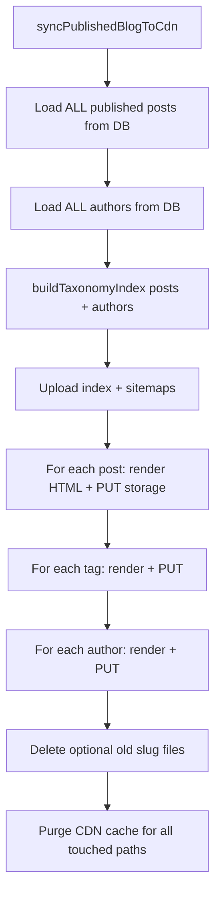

# Blog CDN sync — what actually happens

Public blog URLs (`https://dicebastion.com/posts/...`) are **static HTML files** stored on Bunny Storage and served through the pull zone (`https://dicebastion.b-cdn.net/...`). The Cloudflare memberships Worker proxies browser requests to those files.

The database (Bunny libSQL) is the **source of truth** for post content. CDN files are a **published snapshot** of that data.

Implementation: `bgg-bunny/blog-edge-script.ts` → `syncPublishedBlogToCdn()`, rendering in `bgg-bunny/blog-html.ts`, uploads in `bgg-bunny/blog-cdn.ts`.

---

## Short answer on “rebuild everything”

**Yes.** Every CDN sync is a **full publish** of all currently published content. There is **no incremental or per-post-only sync** in the codebase today.

That is a deliberate trade-off for simplicity: one code path, always consistent list/tag/author/sitemap pages. As post count grows, sync time and upload count grow **linearly** with published posts (plus tags and authors). HTML generation also does extra work per post (see [Scaling](#scaling-as-content-grows) below).

Image uploads in the editor are **not** part of full sync — only the single new image file is written.

---

## When sync runs

| Trigger | What runs |
|--------|-----------|
| Admin **Rebuild CDN** button | `POST /admin/blog/sync-cdn` → full `syncPublishedBlogToCdn()` |
| Create post with status **published** | Full sync after insert |
| Update post while **published** and content/metadata changed | Full sync; if slug changed, old slug’s HTML is **deleted** from storage |
| Publish / unpublish (status change) | Full sync; unpublish deletes that post’s HTML path |
| Save or delete **author** profile | Full sync (author pages and sidebars embed author data) |
| Upload image in blog editor | **Only** `PUT blog/images/...` + purge that URL — **no** full sync |

Draft posts are never written to CDN.

---

## Step-by-step: one full sync



### 1. Database reads

- One query: all rows from `blog_posts` where `status = 'published'` (title, html, images, tags, etc.).
- One query: all rows from `blog_authors`.
- Lightweight schema migration check (`migrateBlogPosts()`).

No pagination; the full published catalog is loaded into memory once.

### 2. Global files (always rewritten)

| Storage path | Public URL (via Worker) | Contents |
|--------------|-------------------------|----------|
| `blog/posts/index.html` | `/posts/` | Blog list |
| `blog/posts/sitemap.xml` | `/posts/sitemap.xml` | URL sitemap (posts, tags, authors, index) |
| `blog/posts/sitemap-images.xml` | `/posts/sitemap-images.xml` | Google image sitemap |

### 3. Per-post files (every published post, every sync)

For **each** published post:

1. `renderBlogPostPage(post, authors, siteUrl, allPosts)` — builds full HTML.
2. `PUT` to `blog/posts/{slug}/index.html`.

Each post page includes a **taxonomy sidebar** built from **all** published posts (`buildTaxonomyIndex(allPosts, authors)`). So changing one post’s tags can affect sidebar links on **every** post page. That is why a single edit still re-uploads all post HTML files.

### 4. Taxonomy pages (every tag and author in the index)

For **each** distinct tag slug: `blog/posts/tag/{slug}/index.html`  
For **each** distinct author slug: `blog/posts/author/{slug}/index.html`  

Each is rendered from the full `posts` array (filtered in the template), then uploaded.

### 5. Deletions (only when `deleteSlugs` passed)

- Slug change on update: old `blog/posts/{oldSlug}/index.html` deleted.
- Unpublish: that post’s path deleted.
- Manual sync does not sweep orphaned files unless those slugs are passed in options.

### 6. CDN cache purge

After all uploads, `purgeBlogPaths()` sends the Bunny API a list of **full CDN URLs** for every path touched (index, sitemaps, every post/tag/author file, deleted paths). Purge requires `BUNNY_PULL_ZONE_ID` and `BUNNY_API_KEY`; if missing, uploads still succeed but edge cache may serve stale HTML until TTL expires.

Uploads are **sequential** (`await` in loops), not parallel batches.

---

## How visitors get a page

```
Browser → dicebastion.com/posts/my-post/
       → Cloudflare Worker (memberships)
       → fetch https://dicebastion.b-cdn.net/blog/posts/my-post/index.html
       → Bunny pull zone → storage file
```

If storage has no file (never synced or wrong slug), the user gets 404.

**Blog sitemaps vs events/shop (Search Console):**

| | Events / shop image sitemap | Blog image sitemap |
|--|---------------------------|-------------------|
| Data | Cloudflare D1 (same Worker) | Bunny libSQL (blog edge script) |
| Generated | Inline in Worker (`buildImageSitemapXml`) | Pre-rendered on sync + Worker serves CDN/API |
| Google fetch path | `dicebastion.com` → Worker only | `dicebastion.com` → Worker → CDN or `*.bunny.run` |

Post images for sitemaps use **dicebastion.b-cdn.net** only (legacy `*.r2.dev` URLs are omitted — [Google requires extra domains to be verified](https://developers.google.com/search/docs/crawling-indexing/sitemaps/image-sitemaps) in Search Console).

**GSC / Worker serving:** Both sitemaps are served by the memberships Worker with **`application/xml; charset=utf-8`**. `posts/sitemap.xml` is **page URLs only** (no `image:image` tags — Google Search Console rejects those in this file). `posts/sitemap-images.xml` carries image metadata. URL sitemap: blog API first, then CDN. Image sitemap: CDN first, then blog API.

**Recommended GSC submit:** both `posts/sitemap.xml` and `posts/sitemap-images.xml` (same pattern as events + `events/sitemap-images.xml`).

---

## What is *not* rebuilt on full sync

- **Draft** posts (not on CDN).
- **Blog images** under `blog/images/...` (uploaded when you crop/save in admin; separate `purgeBlogPaths` for that file only).
- Board games, events, shop, or Hugo site pages.
- Bunny database rows (sync reads DB; it does not copy DB to CDN as JSON).

---

## Scaling as content grows

Rough cost per full sync:

| Resource | Growth |
|----------|--------|
| DB | O(1) query, O(n) rows loaded |
| Storage PUTs | O(n) posts + O(tags) + O(authors) + 3 global files |
| HTML CPU | O(n) renders; each post render scans all posts for sidebar → **O(n²)** CPU in the worst case |
| CDN purge | One API call with O(n + tags + authors) URLs |
| Edge script time limit | Bunny scripts have a max execution time; very large catalogs may eventually need batching or incremental sync (not implemented) |

**Today’s scale:** Tens of posts is fine. Hundreds may feel slow on publish (admin waits for full sync). Thousands would need design changes (incremental sync, sidebar from a smaller index, background job).

**Operational note:** Every publish/edit of a live post triggers a **full** sync automatically, not only the manual **Rebuild CDN** button. The button is for recovery (fix drift, first-time sitemap on CDN, after deploy) or bulk refresh.

---

## Environment and deploy

Blog edge script (`bgg-bunny/dist/blog.js`) needs:

- `BUNNY_DATABASE_URL`, `BUNNY_DATABASE_AUTH_TOKEN`
- `BUNNY_STORAGE_API_KEY`, `BUNNY_STORAGE_ZONE`, `BUNNY_CDN_URL`
- `BUNNY_PULL_ZONE_ID`, `BUNNY_API_KEY` (purge)
- `SITE_URL` (default `https://dicebastion.com`)

Worker (`worker/wrangler.toml`) proxies `/posts/*` using `BUNNY_CDN_URL` and optional `BLOG_API_URL` for sitemap fallback.

After changing `blog-html.ts` or `blog-edge-script.ts`: rebuild `dist/blog.js` with esbuild (see `AGENTS.md`) and deploy the blog script to Bunny; deploy Worker if proxy behavior changed.

---

## Possible future improvements (not built)

These would address “don’t rebuild everything” but are **out of scope** unless implemented:

- Incremental sync: only changed slug + affected tag/author pages + index + sitemaps.
- Background queue for large catalogs.
- Sidebar from a cached taxonomy JSON instead of re-rendering every post against `allPosts`.
- Skip full sync on typo-only edits if nothing on CDN-visible pages changed (would need explicit field-level rules).

Until then, treat **Rebuild CDN** and auto-sync on publish as **full site republish for the blog static layer**.
