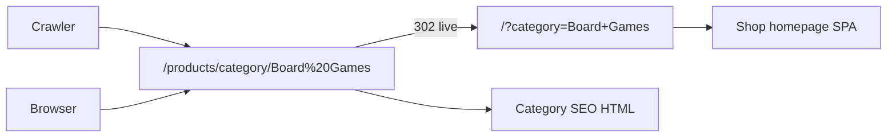

# Shop organic ranking investigation

Date: 2026-09-28  
Scope: organic blue-link ranking for the shop (not Google Business Profile / map pack).  
GSC: not available in this investigation environment — findings use live HTTP checks and public SERP snippets. Confirm in Search Console before treating index counts as final.

Sources used for “what matters”: [Google SEO Starter Guide](https://developers.google.com/search/docs/fundamentals/seo-starter-guide), [ecommerce URL structure](https://developers.google.com/search/docs/specialty/ecommerce/designing-a-url-structure-for-ecommerce-sites), [title links](https://developers.google.com/search/docs/appearance/title-link), [Product structured data](https://developers.google.com/search/docs/appearance/structured-data/product).

---

## Phase 1 — SERP and intent baseline

| Query | Dominant intent | Top organic (observed) | Dice Bastion URL that ranks | Shop category ranking? |
| --- | --- | --- | --- | --- |
| Gibraltar MTG | Mixed play + buy | 1) `dicebastion.com/magic-the-gathering/` (play) 2) main site home 3) `shop.dicebastion.com/` 4) Toy Corner MTG collection (buy) | Play page wins; shop **home** appears, not the MTG category | No |
| Gibraltar Magic the Gathering | Same | Play page, Toy Corner buy collection | Play page | No |
| Gibraltar Riftbound | Mixed play + buy + brand | Wikipedia / YouTube, `dicebastion.com/riftbound/`, Toy Corner Riftbound collection / product | Play page | No |
| Gibraltar Board Games | Mixed club + buy | Main site home, `board-game-library/`, shop home, Toy Corner board-game collections | Home / library; no dedicated buy landing | No |

**Intent read:** Google already associates Dice Bastion with **play / club** for MTG and Riftbound. Toy Corner owns the clearest **buy** collection titles (“Buy … in Gibraltar”). Shop category URLs with strong admin titles are not showing in these SERPs.

**SERP features:** local / map listings may appear for some of these queries. That surface is Google Business Profile, not organic page ranking. It is recorded only as competing screen space.

---

## Phase 2 — Technical crawlability (live production)

Checked against production on 2026-09-28. Local undeployed Worker/Pages changes are **not** live.

| Check | Result | Evidence |
| --- | --- | --- |
| One URL for humans and crawlers | **Fail** | Category path → human `302` to `/?category=…`; product path → human `302` to `/?product=…`. Bot `200` SEO HTML on the path. Google’s ecommerce guidance: minimise alternate URLs for the same content; keep sitemap, links, and canonical consistent. |
| Legacy query URLs | **Fail** | `/?category=Board+Games` returns `200` shop homepage HTML for bots (generic title, no category meta). No 301 to the path. |
| Canonical + sitemap match (bots) | **Pass (encoded names)** | Canonicals like `…/products/category/Magic%3A%20The%20Gathering`, `…/Board%20Games`, `…/Riftbound`. Sitemap lists 8 categories + ~51 product locs (~59 product URL entries including home). |
| Hyphen category slugs (local WIP) | **Not live** | Live `…/magic-the-gathering` and `…/board-games` currently `302` to shop home. Deploy only after Worker + shop JS ship together. |
| Bot HTML usable | **Pass with caveats** | Category bot pages: admin `seo_title` / `seo_description`, CollectionPage + Breadcrumb JSON-LD, product cards. Product bot pages: Product + Offer JSON-LD (price, currency, availability). |
| Human at path | **Fail** | Humans never stay on the canonical path today (302 to query string). |
| `robots.txt` | **Pass** | `Allow: /`; points at sitemap index + image sitemap. |
| Product schema quality | **Mostly pass** | Offer present. `brand.name` is `"Dice Bastion"` on sampled MTG product (likely wrong vs manufacturer). |
| Category indexation signal | **Weak** | `site:shop.dicebastion.com/products/category` returned no results. Homepage is discoverable; category paths are not clearly indexed in public results. |

---

## Phase 3 — On-page relevance

### Category titles (admin already set)

From `GET https://dicebastion.com/api/product-categories`:

| Category | seo_title (admin) | Live bot `<title>` matches? |
| --- | --- | --- |
| Magic: The Gathering | Magic the Gathering Gibraltar \| Buy MTG \| … | Yes |
| Riftbound | Riftbound Gibraltar \| Buy Riftbound Cards… | Yes |
| Board Games | Board Games Gibraltar \| Buy Board Games… | Yes |
| Rpg / Card Games / others | empty | Defaults only |

Admin SEO fields for the three featured categories are already commercial and aligned with buy-intent queries. Title quality is not the primary gap vs Toy Corner.

### Visible body depth (crawler HTML)

| Page | What the bot sees in the body | Approx. unique prose |
| --- | --- | --- |
| Shop category (e.g. Board Games) | H1 = category name, “N products”, product name + price cards, CTA | ~300 characters; **admin `seo_description` is meta-only, not in the page body** |
| Toy Corner MTG collection | H1 + multi-paragraph buy copy + product grid + FAQ block | Substantially more unique on-page text |
| Dice Bastion MTG play page | Full editorial play copy | Strong for play intent (already ranks) |

Google’s starter guide stresses unique, helpful on-page content. Meta description alone is not a substitute for body text.

### Products

- ~51 active catalogue products in API; **22 lack `summary`**.
- Sampled product SEO description uses manufacturer-style copy (usable, not always shop-unique).
- Product URLs are already hyphenated slugs (event-like pattern).

### Internal linking / landing pages

| Asset | Role |
| --- | --- |
| `content/magic-the-gathering.md` | Play landing; links into shop category |
| `content/riftbound.md` | Play landing; links into shop category |
| `content/board-game-library.md` | **Play/library**, not a buy page |
| Shop Board Games category | Buy surface, thin body, not ranking |
| Main-site Board Games buy/play page | **Missing** (unlike MTG / Riftbound) |

### Shop homepage meta

- [shop/hugo.toml](../shop/hugo.toml): solid Gibraltar shop title/description.
- [shop/layouts/_default/baseof.html](../shop/layouts/_default/baseof.html): home `og:title` uses `Site.Title`; `og:description` always uses `Site.Params.description` (minor consistency quirk, low impact vs category crawl split).

---

## Phase 4 — Indexation and authority (lightweight)

| Observation | Note |
| --- | --- |
| Public `site:` for category paths | No hits found |
| Public mentions of `shop.dicebastion.com` | Mostly own properties (shop home, main site). Few third-party links to category/product URLs observed |
| Competitor | Toy Corner is an established retail domain with long collection URLs and denser collection copy |
| Implication | Fixing crawl/URL consistency and on-page relevance is necessary. Even then, buy-intent queries may stay competitive if authority and unique collection content lag. Do not expect meta-only or FAQ-copying to close the gap |

GSC Links / Coverage reports should replace this snapshot when you have access.

---

## Phase 5 — Ranked recommendations (approval required)

No implementation from this memo until you approve specific items.

### 1. Deploy URL unification (highest priority)

**Evidence:** Live humans `302` from `/products/...` to `/?product=` / `/?category=`; bots get a different URL. Query URLs do not carry category SEO for bots. Violates Google’s “one URL / consistent links / canonical / sitemap” guidance.

**Expected effect:** Indexability and relevance consolidation on the shareable path; removes split signals.

**Surface:** Deploy the already-prepared Worker + shop Pages work together (path stays in the address bar; legacy query → 301). Do not deploy Worker alone.

**Effort:** Deploy + smoke-test; no new SEO features.

### 2. Inspect and request indexing in Search Console

**Evidence:** Category paths not showing in `site:` results despite sitemap entries.

**Expected effect:** Faster discovery of category URLs after (1).

**Surface:** GSC only (manual).

**Effort:** Low.

### 3. Put category SEO description into visible category HTML (or a short unique intro)

**Evidence:** Bot category body is essentially H1 + product list; admin `seo_description` exists but is not in the body. Toy Corner ranks buy queries with denser unique collection prose. Google starter guide: unique helpful content on the page.

**Expected effect:** Stronger buy-intent relevance for category URLs after they are crawlable as one URL.

**Surface:** Worker `generateCategorySeoPage` (render admin description under H1). Optionally allow a longer “intro” field later — not required if description is enough.

**Effort:** Small code change + keep using existing admin fields. **Needs your OK.**

### 4. Main-site Board Games landing (play and/or buy), parallel to MTG / Riftbound

**Evidence:** Board Games SERP sends traffic to home / library / shop home / Toy Corner. MTG and Riftbound already win play intent via dedicated pages. Library page is not a buy page.

**Expected effect:** Capture play/club intent and pass internal links to the shop Board Games category.

**Surface:** New main-site content page + internal links. **Needs your OK on copy and URL.**

**Effort:** Content + light wiring.

### 5. Editorial product summaries

**Evidence:** 22/51 products missing `summary`; Google/Shopify guidance: thin or duplicate catalogue copy underperforms.

**Expected effect:** Better product snippets and page substance over time.

**Surface:** Admin product fields only (process, not code).

**Effort:** Ongoing editorial.

### 6. Optional schema tidy

**Evidence:** Product `brand` set to Dice Bastion on sampled MTG item.

**Expected effect:** Cleaner Product rich-result eligibility; unlikely to move category SERPs alone.

**Surface:** Worker product schema. **Needs your OK.**

### Explicitly not recommended from this investigation

- Adding phone / NAP / FAQ blocks because Toy Corner has them (local-pack / GBP surface, not proven organic shop ranking requirements).
- Inventing hardcoded “Buy X in Gibraltar” titles that override admin SEO (admin titles are already set).
- Treating hyphenated URLs as a ranking silver bullet separate from “one consistent URL”.

---

## Working rule

This document is the investigation deliverable. Implementation waits on your approval of numbered items above.
